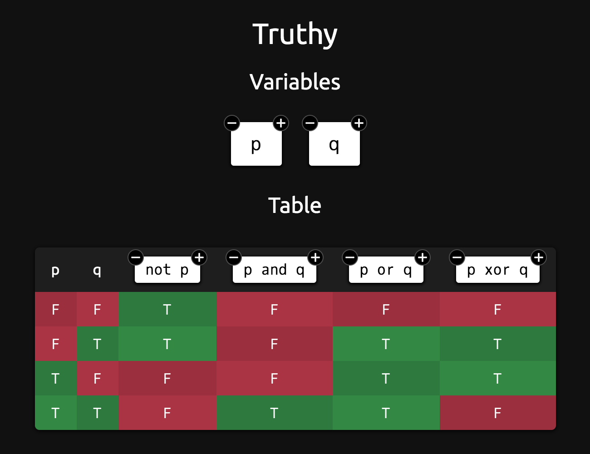

# Truthy

*Copyright 2016-2021, Caleb Evans*  
*Released under the MIT License*

[](https://app.travis-ci.com/caleb531/truthy)
[](https://coveralls.io/github/caleb531/truthy?branch=master)

Truth tables have always been tedious and strenuous to create by hand; it's easy
for your mind to lose track and for your hand to fatigue. Truthy is a web app
designed to reduce this manual labor by automatically generating the truth
tables for any boolean expressions you supply.

You can view the app online at:  
https://projects.calebevans.me/truthy/



## Run the project locally

### 1. Install global dependencies

The project requires Node.js and Brunch, so make sure you have both.

```bash
brew install node
```

```bash
npm install -g gulp-cli
```

### 2. Install project dependencies

From the cloned project directory, run:

```bash
npm install
```

### 3. Serve app locally

To serve the app locally, run:

```bash
gulp serve
```

When run, the app will be accessible at `http://localhost:8080`.
